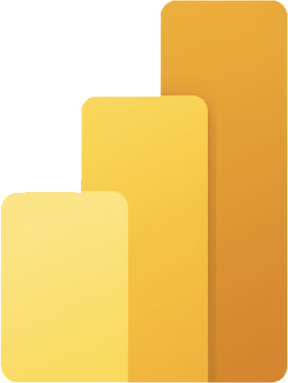

	 
	

<!-- Main Tech Stack -->
<h2 align="center">Main Stack</h2>

  
  
  
  
  

<!-- General Stack -->
<h2 align="center">General Stack</h2>

  
  
  

 

    

        
    

    

        
    

    
	

---

## 🔧 Tech Stack Principal

- 🛠️ **Back‑end & APIs**: FastAPI 🐍 | Airflow ☁️  

- 📊 **BI & Analytics**: Qlik Sense 📈 | Power BI 💥  

- 🤖 **Data Science & IA**:  
  - ML: scikit‑learn 🚀 | XGBoost ⚡ | MLflow 🔄  
  - DL: TensorFlow 🧠 | PyTorch 🔥  

- 🚀 **Infra & DevOps**: Docker 🐳 | Kubernetes ☸️  
  - CI/CD: GitHub Actions ⚙️ | Drone CI 🤖  
  - Observability: Prometheus 📈 | Grafana 📊 | ELK 🐘
